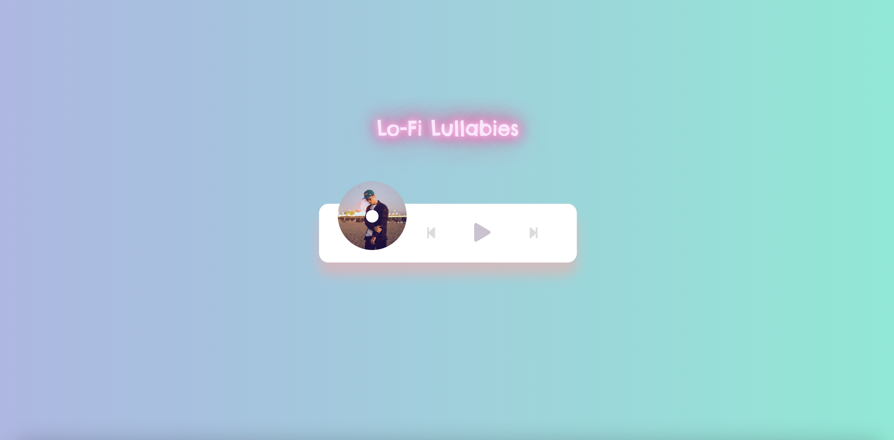

# Lo-Fi Lullabies

[](https://opensource.org/licenses/MIT)

## Table of Contents

- [Description](#description)
- [User Story](#user-story)
- [Features of the Application](#features-of-the-application)
- [Preview of Lo-Fi Lullabies](#preview-of-lo-fi-lullabies)
- [Links](#links)
- [Built Using](#built-using)
- [License](#license)
- [Questions](#questions)

## Description

Lo-Fi Lullabies is a custom, mobile-responsive music playing application with a simple user interface that features some animation. With Lo-Fi Lullabies you can browse and play up to ten different tracks.

The application utilizes the Audio API (play method, pause method, timeupdate event, etc.) and features a dynamic progress bar that can be used to skip around the track that is being played.

## User Story

```
AS A user
I WANT TO play music
SO THAT I can foster a creative environment.
```

## Features of the Application

```
GIVEN a music player application
WHEN I click on the "Play" icon
THEN I will start the track.

WHEN I click on the "Pause" icon
THEN I will pause the track.

WHEN I click on the "Next" icon
THEN I will skip to the next track.

WHEN I click on the "Previous" icon
THEN I will skip to the previous track.

WHEN I click on a part of the progress bar
THEN I will skip to the corresponding part of the track.
```

## Preview of Lo-Fi Lullabies

<p align="center">
  
</p>

## Links

- [Deployed Application](https://rh9891.github.io/LoFiLullabies)

- [Github Repository](https://github.com/rh9891/LoFiLullabies)

## Built Using

Listed below are the frameworks, libraries, and guides that made building this application possible:

- [HTML5 Audio API](https://developer.mozilla.org/en-US/docs/Web/API/Web_Audio_API)
- [HTML Audio DOM Reference](https://www.w3schools.com/tags/ref_av_dom.asp)
- [JavaScript](https://www.w3schools.com/js/default.asp)
- [Traversy Media Tutorials](https://www.traversymedia.com)

## License

The MIT License (MIT)

Copyright (c) 2021 Romie Hecdivert

Permission is hereby granted, free of charge, to any person obtaining a copy of this software and associated documentation files (the "Software"), to deal in the Software without restriction, including without limitation the rights to use, copy, modify, merge, publish, distribute, sublicense, and/or sell copies of the Software, and to permit persons to whom the Software is furnished to do so, subject to the following conditions:

The above copyright notice and this permission notice shall be included in all copies or substantial portions of the Software.

THE SOFTWARE IS PROVIDED "AS IS", WITHOUT WARRANTY OF ANY KIND, EXPRESS OR IMPLIED, INCLUDING BUT NOT LIMITED TO THE WARRANTIES OF MERCHANTABILITY, FITNESS FOR A PARTICULAR PURPOSE AND NONINFRINGEMENT. IN NO EVENT SHALL THE AUTHORS OR COPYRIGHT HOLDERS BE LIABLE FOR ANY CLAIM, DAMAGES OR OTHER LIABILITY, WHETHER IN AN ACTION OF CONTRACT, TORT OR OTHERWISE, ARISING FROM, OUT OF OR IN CONNECTION WITH THE SOFTWARE OR THE USE OR OTHER DEALINGS IN THE SOFTWARE.

## Questions

If you have any questions, comments, or issues regarding this application, please do not hesitate to contact me via [Github](https://github.com/rh9891).
